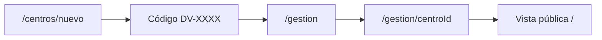

# Donaciones VE — Centros de Acopio (Venezuela)

Plataforma ultra-ligera para unificar información en vivo sobre centros de acopio y necesidades de insumos tras emergencias en Venezuela.

## Stack

- **Frontend:** Next.js (App Router), TypeScript, Tailwind CSS
- **Backend/DB:** Supabase (PostgreSQL)
- **Deploy:** Vercel

## Flujo de usuario

### Ciudadano (vista pública)
1. Entra a `/` y filtra por **Estado** y **Municipio**.
2. Ve centros activos con semáforo de urgencia e insumos requeridos.
3. Copia el reporte en texto plano para WhatsApp/SMS.

### Responsable de centro
1. Registra su centro en `/centros/nuevo` (datos del centro + nombre/teléfono del responsable).
2. Recibe un **código de gestión** (`DV-XXXX-XXXX-XXXX`) — guárdalo, no se vuelve a mostrar.
3. Administra en `/gestion` ingresando el código.
4. Actualiza contacto, vialidad y necesidades en `/gestion/[centroId]`.

### Moderación
- Panel en `/moderacion?token=...` para verificar centros y ajustar urgencias globalmente.



## Configuración local

```bash
npm install
cp .env.example .env.local
# Completa las variables de Supabase
```

Ejecuta [`supabase_schema.sql`](./supabase_schema.sql) en el SQL Editor de Supabase.

```bash
npm run dev
```

Abre [http://localhost:3000](http://localhost:3000).

### Modo demo (sin Supabase)
- La home muestra datos mock.
- Registro de centros requiere Supabase configurado.
- Para probar el panel de gestión mock: `/gestion/c-1?codigo=DEMO`

## Variables de entorno

| Variable | Entorno | Descripción |
|----------|---------|-------------|
| `NEXT_PUBLIC_SUPABASE_URL` | All | URL del proyecto Supabase |
| `NEXT_PUBLIC_SUPABASE_ANON_KEY` | All | Clave anónima (solo lectura pública vía RLS) |
| `SUPABASE_SERVICE_ROLE_KEY` | Server only | Escrituras: registro, gestión, moderación |
| `MODERADOR_ACCESS_TOKEN` | Server only | Acceso al panel `/moderacion` |

> **Nunca** expongas `SUPABASE_SERVICE_ROLE_KEY` en variables `NEXT_PUBLIC_*`.

## Despliegue en Vercel

### GitHub (recomendado)
1. Importa el repo en [Vercel](https://vercel.com/new).
2. Agrega las 4 variables de entorno en **Settings → Environment Variables**.
3. Deploy en `main`.

### Vercel CLI

```bash
npm i -g vercel
vercel login
vercel link
vercel env pull .env.local --yes

# Si faltan variables:
# vercel env add NEXT_PUBLIC_SUPABASE_URL production preview development
# vercel env add NEXT_PUBLIC_SUPABASE_ANON_KEY production preview development
# vercel env add SUPABASE_SERVICE_ROLE_KEY production preview
# vercel env add MODERADOR_ACCESS_TOKEN production preview

vercel --prod
```

### Checklist pre-producción
- [ ] SQL ejecutado en Supabase (`supabase_schema.sql`)
- [ ] RLS activo (lectura pública, escrituras solo service role)
- [ ] Variables configuradas en Vercel (Production + Preview)
- [ ] Probar: registrar centro → guardar código → gestionar → ver en home
- [ ] `npm run build` sin errores

## Rutas

| Ruta | Descripción |
|------|-------------|
| `/` | Vista pública con filtros geográficos |
| `/centros/nuevo` | Registro de centro + código de gestión |
| `/gestion` | Ingreso con código de gestión |
| `/gestion/[centroId]?codigo=...` | Panel del responsable |
| `/moderacion?token=...` | Panel de moderadores |

## Seguridad

- El código de gestión se guarda hasheado (SHA-256) en Supabase.
- Datos del responsable (`responsable_nombre`, `responsable_telefono`) no se exponen en la API pública.
- Centros nuevos quedan `verificado = false` hasta moderación.

## Licencia

Uso comunitario durante la emergencia.
